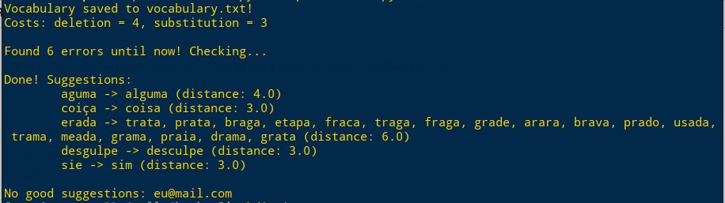

# Corretor Ortográfico

**Número da Lista**: 5<br>
**Conteúdo da Disciplina**: Programação Dinâmica<br>

## Alunos

|Matrícula | Aluno |
| -- | -- |
| 15/0129815 | Ícaro Pires de Souza Aragão |
| 16/0144752 | Sara Conceição de S. A. Silva |

## Sobre 

O trabalho consiste em um corretor ortográfico que usa o algoritmo de *edit distance* para calcular a semelhança entre as palavras.

### Base de palavras

O corretor se baseia no arquivo *corpus.txt* que funciona como uma base palavras. O arquivo foi feito com textos de notícias selecionadas aleatoriamente.

### Vocabulário

Será gerado durante a execução do programa um arquivo *vocabulary.txt* que guarda as palavras conhecidas pelo corretor, baseado no arquivo *corpusi.txt*

## Visualização

Abaixo está a saída para o arquivo *to_fix.txt*.

A saída exibe as sugestões de correções para as palavras que o corretor não conhece e também a distância encontrada entre a palavra desconhecida e as sugeridas.

Além disso, o corretor mostra as palavras desconhecidas que não obtiveram boas sugestões, por terem uma distância maior que 15 entre as palavras conhecidas pelo corretor. Por fim, a saída exibe também a contagem de erros, substituições e deleções calculadas pelo algoritmo.



## Instalação 

**Linguagem**: Python 3.7

Instale as dependências do python com:

``` sh
# Ou apenas pip ao invés de pip3 no Arch
# É melhor instalar na virtualenv ao invés de no usuário
pip3 install -r requirements.txt --user
```

## Uso 

Após a instalação das dependências basta executar o seguinte comando:

``` sh
python3 spellchecker.py to_fix.txt
```
